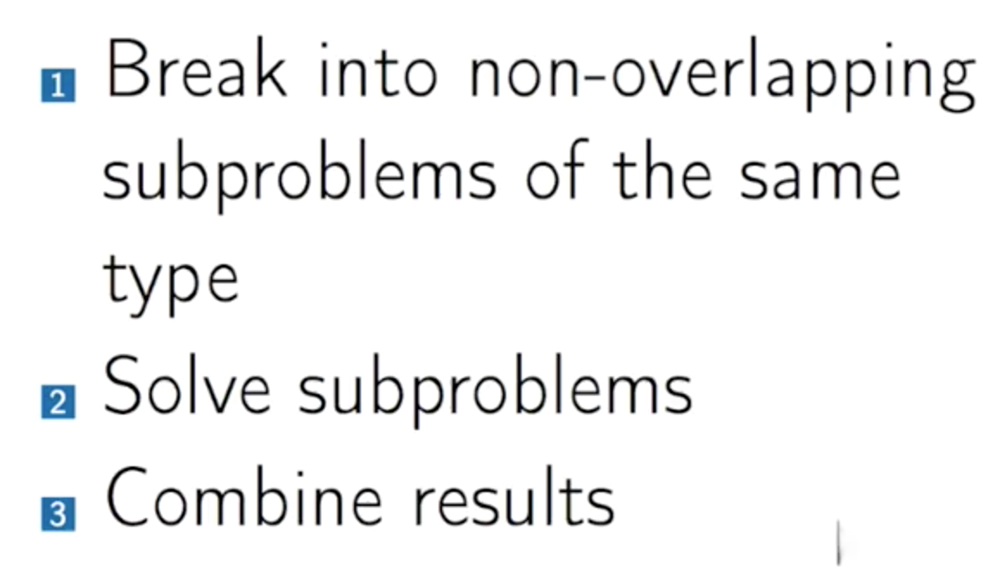

[toc]

## Algorithmic Toolbox
内容是针对 Coursera 中专项课程 [Data Structures and Algorithms ](https://www.coursera.org/specializations/data-structures-algorithms) 的第一个课程。

### 1 算法设计流程
1. 理解问题
2. 设计一个算法
3. 执行算法
4. 测试和 debug 算法

	>测试的过程主要需要从一下几个方面考虑：手动测试、溢出测试、大值测试以及压力测试；结果需要在限定的硬件设备上，从运行时间和运行结果两个方面考虑
	
### 2 算法
算法的作用，一方面是通过合适的方式解决问题，另一方面是优化算法提高问题解决效率。从以下算法运行比价结果来看，考虑算法的优化一方面要考虑解决的问题思路，另一方面需要从数据的结构考虑。

* 递归解决斐波那契数列的方法

	> 递归的方式解决斐波那契数列，是通过不断去将数值变小，并最终从内向结算。这样导致重复计算，计算开销变大
	
* 数组解决斐波那契数列方法

	>提供了一个线性数据表，减少了重复计算的消耗
	
	```{blueprint}
	create an array F[0...n]
	F[0] <- 0
	F[1] <- 1
	
	for i from 2 to n:
		F[i] <- F[i - 1] + F[i - 2]
	
	return F[n]
	```	
* 直接循环方式求解最大公因数（ Greatest Common Divisor ）

	> GCD的应用，不仅是在寻找质数、除数，而且对加密方面也有应用
	
	```{blueprint}
	# 简单方式
	function NaiveGCD(a, b)
	best <- 0
	for d from 1 to a + b:
		if a % d and b / d:
			best <- d
	return best
	```
* 优化方式求解最大公因数

	> GCD 优化是利用了数学公里——假设 `a` 除以 `b` 具有余数 `a'`，那么存在 ${GCD(a, b)=GCD(a', b)}=GCD(b, a')$。具体解释见 [The Euclidean Algorithm (article) | Khan Academy](https://www.khanacademy.org/computing/computer-science/cryptography/modarithmetic/a/the-euclidean-algorithm)。该方法的步骤数降为 `log(ab)`。
	
	```{blueprint}
	# Euclidean 优化方式
	function EuclidGCD(a, b)
	if b = 0:
		return a
	a' <- the remainder when a is divided by b
	
	return EuclidGCD(b, a') # 这里 b 的位置需要交换
	```
	
### 3 算法评估
在机器运行代码的过程中，所有的语言都需要被编码为机器语言才能被运行。因此在机器层面来说，算法运行的评估需要考虑存储开销、地址查询开销、算法运行开销，这样导致实际对算法进行评估过于复杂（而且在实际过程中机器的性能对运行开销也有影响）。但是在实际进行算法评估中，对这类底层架构不用细化考虑，不用对运行时间进行详细评估。

计算机算法运行架构图：


因此在实际进行算法评估的过程中，忽略了机器运行时候的常数，而是采用输入的规模变化对运行时间影响来评估算法。文档说明见[Asymptotic notation (article) | Algorithms | Khan Academy](https://www.khanacademy.org/computing/computer-science/algorithms/asymptotic-notation/a/asymptotic-notation)

* Big O 概念

	>定义：f(n) = O(g(n))(f is Big-O of g), if there exist constants N and c so that for all n > N, f(n) <= c * g(n).
	
	>定义说明了 f 存在一个上界，由常数和函数 g 相乘。因为 f 函数的增量在一定情况下是由函数中的最大变化量决定的（利用渐近线分析——最终在达到某个输入量的时候，会趋于稳定），所有通过这样评估方式即采用 Big O 来评估算法。
	>它的优势在于通过输入量来决定算法的运行时间，可以大概评估出在达到多大的输入范围事，算法可能“无法”解决问题，可以比较不同算法之间的运行效率
	
	需要注意在使用 Big O 来评估算法的时候，是忽略了很多重要信息例如函数中的常数 N 和 c；而且 Big O 仅仅是渐进方式评估算法。下图中是对优化的斐波那契数列算法评估的实际应用举例：
	
	
	
* 算法的其他评估概念—— Big Theta 和 Big Omega


算法练习：

1. ${n^2=O(n^3)}$: ${n^a}$ grows slower than ${n^b}$ for constants ${a<b}$
2. ${n=O(\sqrt{n})}$: ${\sqrt{n}=n^{1/2}}$ grows slower than ${n=n^1}$ as ${1/2<1}$
3. ${5^{log_2n}\neq{O(n^2)}}$: Recall that ${a^{log_bc}=c^{log_ba}}$ so ${5^{log_2n}=n^{log_25}}$. This grows faster than ${n^2}$ since ${log_25=2.321…>2}$
4. ${2^n=O(2^{n+1})}$ : ${2^{n+1}=2*2n}$, that is, ${2^n}$ and ${2^{n+1}}$ have the same growth rate and hence ${2^n=Θ(2^{n+1})}$

### 4 算法的实际应用

#### 4.1 贪心算法

贪心算法的流程，在不断地迭代过程中更新取值范围和结果——这样通过不断地将大问题变为小的子问题，以达到最后求解的方式。首先需要选择一个合适的贪婪抉择，证明其是一个合适的选择，将问题减少一个子问题，解决这个子问题。需要注意这是一个不断迭代的过程，以达到最终解决问题的目的。如下为获取最大值的数字：
	
```
# 在 3,9,5,9,7,1 几个数字中排序获得最大数字
LargestNumber(3,9,5,9,7,1)：
	“9” + LargestNumber(3,5,9,7,1)
```
另一例子是在 A、B 之间以最少次数加油的策略达到终点，${x_n}$ 表示有加油站的距离（实际应用中可以当作数组）：

	
算法时间评估：


对贪心算法进行总结，该算法主要的步骤如下：

1. safe move
2. prove safe
3. solve subproblem
4. estimate running time

对贪心算法，优化排序策略可以从以下几个方面进行考虑：

1. 输入对象是否可以排序
2. 排序方式是否可以更快速筛选
3. 贪心算法运行是否更快速

##### 4.1.1 分组事件

分群算法的例子，是对一群儿童进行分组，其中每组组内的儿童年龄最大相差不超过一年，对这样的条件内可以分出最少的群组数量。算法逻辑如下：
	
```
# C 为整体数量
MinGroup(C)：
	m <- len(C)
	for each partition into groups
	C = G1 U G2 U G3 U ... Gk:	# C 被分为 k 个群组
		good <- true	# 设置一个检验逻辑值，用于判断每次迭代的结果是否可行
		
		for i from 1 to k:
			if max(Gi) - min(Gi) > 1:
				good <- false
		
		if good:
			m <- min(m, k)	# 判断得到的群组数量和 C 的总体数量进行比较，获取最小值
	
```
	
因为以上的简单算法，评估的运行时间 ${\Omega}$ 值为 ${2^n}$，当运行的数据规模越大的时候，耗费时间太大。该分群算法可以优化，思路是因为分群是限制了取值的范围了。初始阶段可以先通过建立一个合适的取值范围，不断优化最左端值和最小值来构建合适的范围——以此保证最左端数据点在分群内；其后需要不断迭代，找出之后的组。具体解释如下：

经过以上方式来进行新的算法更新后，算法的运行时间为 ${O}$ 的值为 ${nlog(n)}$，注意该算法需要一个排序过程以获得最左端值。算法说明如下：
	
```
# 该算法是取得取值范围， R 是一个范围集合
PointsCoverSorted(X1,...,Xn):
	R <- {}, i <- 1
	while i<= N:
		[l, r] <- [Xi, Xi + 1]
		R <- R U {[l, r]}	# 将 [l, r] 以集合的并集更新到 R 中
		i <- i + 1
		while i <= n and Xi <= r:
			i <- i + 1
	return R
```
	
##### 4.1.2 部分背包事件——Fractional Knapsack
	
事件是为了解决长途旅行中，装入包裹中的物品如何保障最大能量，以能够行走最大的旅程。该事件进行分析，结构如下：


对以上说明，每样食物重量和每样食物能量值，包裹可装最大容量作为输入；获得最大包装容量的情况下能获得的最大能量值作为输出。**注意⚠️：**在实际应用过程中需要注意到，计算应该用到的是每项物品的单位值而非整体值，以下的例子中应该考虑最大单位值优先以获取最大能量值，最大值应该是 42：


Knapsack 算法伪代码如下：


对于以上代码，其算法运行时间 ${O}$ 为 ${n^2}$。从其中可以看出，每轮 loop 都需要对筛选出最大的 ${\frac{v_i}{w_i}}$，这样增大了算法开销。可以通过优先对 w 通过最大单位价值进行排序，在装包。优化伪代码如下：


更新后的伪代码运行时间开销  ${O}$ 为 ${n\ logn}$。

#### 4.2 分治算法——Divide and Conqure
该算法是通过对问题分解为类型相同小问题求解——要求在分解问题时，小问题之间不能有重叠，而且问题类型要相同。最后将已经解决小问题进行组合以完成问题的求解。所以该算法的基本流程如下：



##### 4.2.1 线性搜索——Linear Search
	
线性搜索一般是在数据中一个个挨着进行搜索，并最终返回合适的结果。其搜索方式如下：
	
```
# Searching in an array
	Input: An array A with n elements. A's key k
	Output: An index, i, where A[i] = k
		If there is no such i, then Not_Found
```
	
构造算法来看，需要设定一个基本情况( base case )，将其他问题设为一个子问题来求解，符合条件返回相应的值。该算法评估时间 ${\Theta}$ 为 ${n}$ ，实际运行情况下，最优时间是在查找到第一个值为被查询值，即时间为 ${O(1)}$；在最差时间是在被查值在最后一个位置上或者是被查值没有在数组中，即时间为 ${O(n)}$。在实际的算法伪代码如下：
	
```
LinearSearch(A, low, high, key):
	if high < low:
		return Not_Found
	if A[low] = key:
		return low
	
	return LiearSearch(A, low + 1, high, key)
```
	
##### 4.2.2 二分查找——Binary Search
对已经排序的数据进行查找的时候，如果用线性搜索会消耗太多的时间，实际情况是可以通过其他方式进行优化。该方式进行查找最重要的条件是数组进行排序，实际解释，参考文档[Binary search (article) | Algorithms | Khan Academy](https://www.khanacademy.org/computing/computer-science/algorithms/binary-search/a/binary-search)。其搜索方式如下：
	
```
# Searching in a sorted array
Input: A sorted array A[low...high]
	(low <= i < high: A[i] <= A[i + 1])
	A key k.
	
Output: An index i, (low <= i <= high) where A[i] = k.
	Otherwise, the greatest index i, where A[i] < k.
	Otherwise, k <= A[low], the result is low
```	
	
该算法的时间开销变少，${\Theta(log\ n)}$，伪代码如下：
	
```
BinarySearch(A, low, high, key):
	if high < low:
		return low - 1
	mid <- low + (high - low) / 2
	
	if key = A[mid]:
		return mid
	else if key < A[mid]:
		return BinarySearch(A, low, mid - 1, key)
	else:
		return BinarySearch(A, mid + 1, high, key)
```
	
以上算法是通过递归的方式进行查找，这样会导致空间开销增大，可以通过迭代的方式来进行搜索减少空间开销：
	
```
BinarySearchIt(A, low, high, key):
	while low <= high:
		mid <- low + (high - low) / 2
		
		if key = A[mid]:
			return mid
		else if key < A[mid]:
			high  = mid - 1
		else:
			low = mid + 1
		return low - 1
```

##### 4.2.3 多项式查找——Polynomial Multiplication
在多项式查找的实际应用例子，包括了错误检测和纠正（ Error-correcting codes ）、大整数乘法（ Large-integer Multiplication ）、母函数（即[母函数](https://zh.wikipedia.org/wiki/%E6%AF%8D%E5%87%BD%E6%95%B0)， Generating Function ）以及 Convolution in signal progressing。算法模式：


算法运行时间为 ${O(n^2)}$，其伪代码如下：

```
# A 和 B 是多项式的系数作为数组
MultPoly(A, B, n):
	product <- Array[2n - 1]
	
	for i from 0 to 2n - 2:
		product[i]  <- 0
	
	for i from 0 to n - 1:
		for j from 0 to n - 1:
			product[i + j] <- product[i + j] + A[i] * B[j]
```

对算法进行优化，通过将 A 和 B 的多项式拆分来处理，${A(x)=D_1(x)*x^{n/2}+D_0(x)}$ 以及 ${B(x)=E_1(x)*x^{n/2}+E_0(x)}$，然后计算模式演变为 ${A*B=(D_1(x)*x^{n/2}+D_0(x))*(E_1(x)*x^{n/2}+E_0(x))=(D_1E_1)*x^n+(D_1E_0+D_0E_1)*x^{n/2}+D_0E_0}$，其后计算对应的参数 ${D_1E_1}$、 ${D_1E_0+D_0E_1}$ 以及 ${D_0E_0}$。其中需要注意，设定的 x 多项式数量 n 值应该是 2 的倍数，如果非 2 的倍数可以通过假定有一个系数为 0 的高阶项。其算法优化举例如下：


其算法运行预估为 ${\Theta(n^2)}$，伪代码如下：


* 算法优化——Karatsuba Approach

	其思路是更改中间项 ${D_1E_0+D_0E_1}$ 为 ${(D_1+D_0)(E_1+E_0)-D_1E_1-D_0E_0}$，以减少需要计算的量。实际举例如下：
	
	

##### 4.2.4 主定理——Master Theorem
[主定理](https://zh.wikipedia.org/wiki/%E4%B8%BB%E5%AE%9A%E7%90%86)，在算法中表达了分治法中的递推关系：${If\ T(n) = aT([\frac{n}{b}])\ +\ O(n^d)}$ 其中参数要求 a > 0、b > 1、d >= 0，可以得出以下结论如下：


上式中 ${O(n^d)}$ 是将问题分解后得到的多项式开销。

##### 4.2.5 排序问题——Sorting Problem
根据输入是数据，按照合适的方式进行排序输出。主要有两方面的作用：1）一般情况下，排序的数据能够提高算法的效率；2）排序数据更方便查询。

1. 选择排序——Selection Sort

	通过 scan 数据查找到符合条件的数据，将查找到的数据和第一个索引值进行交换；然后一次按照该方式进行查找交换以完成排序。该算法的运行时间为 ${O(n^2)}$，其伪代码如下：
	
	```
	SelectionSort(A[1,...,n]):
		for i form i to n"
			minIndex <- i
			
			# A[minIndex] = min{A[i,...,n]}
			
			for j form i + 1 to n:
				if A[j] < A[minIndex]:
					minIndex <- j
			
			swap(A[i], A[minIndex])
	```
2. 插入排序——Merge Sort

	先对数据进行分割，分别对分割后数据进行排序，之后将一个分割后的数据按照合适的顺序插入另一个分割的已排序数据中。该算法的运行时间评估为 ${O(nlog\ n)}$，其伪代码如下：
	
	```
	# MergeSort 中存在一个调用函数 Merge
	MergeSort(A[1,...,n]):
		if n = 1:
			return A
		m <- n / 2
		B <- MergeSort(A[1,...,m])
		C <- MergeSort(A[m+1,...,n])
		
		A' <- Merge(B, C)
		return A'
		
	Merge(B[1,...p], C[1,...,q]):
		D <- empty array of size p + q
		
		while B and C are both non-empty:
			b <- the first element of B
			c <- the first element of C
			
			if b <= c:
				move b from B to the end of D
			else:
				move c from C to the end of D
		# 保证所有数据都被存放到 D 中，所以需要将最后数据移动到 D 中
		move the rest of B and C to the end of D
		
		return D
	```
	
	可视化图形举例如下：
	
	
排序问题中衍生出两个方式：

1）基于比较排序的下界( Lower Bound for Comparison Based Sorting )，即通过对数据对进行比较排序，实际应用中选择排序和插入排序都是基于比较。那么针对给予比较排序算法的下界问题就演变成了 ${\Omega}$ 值——即在最坏的条件下排序所花费的开销。下图是利用决策树方式模拟三元素的比较排序:
	

	
从其中可以估计出决策树的深度 ${l}$ 至少为 ${n!}$；因此最大的时间开销是由于比较运算的数量决定，即至少为深度值 d。那么综合来看可以得出 ${d\geq log_2l}$。在最坏条件下，该算法的运行时间为 ${log_2(n!)=\Omega(nlog\ n)}$，该算法时间开销证明如下：
	


2）基于非比较排序算法（ Non-Comparsion Based Sorting Algorithm），其方式是针对重复的数值类型进行排序。通过统计数值类型数据的数量，按照数值的大小以及统计的数量进行排序。实际举例使用数组的方式，具体如下：


>解释：上图中是先对 1、2 和 3 等三个数值组成的数组，分别统计三个数值的数量；根据三个数值的大小和数量（ 1 有 2 个，2 有 7 个，3 有 3 个）分别进行重新排序。该算法中，没有对数值进行分别比较。

该算法的运行时间为 ${O(n+M)}$，因为 ${M}$ 为数值个数可以作为常数计算，那么该算法的运行时间最后为 ${O(n)}$，其伪代码如下：

```
CountSort(A[1,...,n]):
	Count[1,...,M] <- [0,...,0]	# 数组 A 是含有 1 到 M 的数值构成的数组，现优先对数组初始化为 0
	
	for i from 1 to n:
		Count[A[i]] <- Count[A[i]] + 1	# 遍历数组中的数值，统计到 Count 数组中
	Pos[1,...M] <- [0,...,0]
	Pos[1] <- 1
	
	for j from 2 to M:
		Pos[j] <- Pos[j-1] + Count[j-1]	# 分别计算出 1 到 M 的数值在新数组中的位置
	
	for i from 1 to n:
		A'[Pos[A[i]]] <- A[i]
		Pos[A[i]] <- Pos[A[i]] + 1
```

##### 4.2.6 快速排序——Quick Sort
快速排序算法是基于比较方式的算法，平均运行时间为 ${O(nlog\ n)}$，最差的运行时间为 ${O(n^2)}$ 其在实际应用中效率较高。其算法方式是先对数据进行一个比较拆分（比较是基于一个选定的数值），针对拆分完成的两部分数据分别进行排序以获得完整的排序数据（实际中是使用了递归的方式）。根据实际数组距离如下：


快速排序的伪代码以及其分析的示例如下：

```
# A 为一个数组， l 和 r 分别为数组的左端和右端
QuickSort(A, l, r):
	if l >= r:
		return
	m <- Partition(A, l, r)		# m 为选择的一个数组中的某个元素的索引值
	
	QuickSort(A, l, m - 1)		# 对拆分的左侧数组进行快速排序
	QuickSort(A, m + 1, r)		# 对拆分的右侧数组进行快速排序
	
Partition(A, l, r):
	x <- A[l]		# 选定的一个基准元素
	j <- l
	
	for i from l + 1 to r:
		if A[i] <= x:
			j <- j + 1
			swap A[j] and A[i]
			
	swap A[l] and A[j]		# 将选定的基准元素放置在其相应的位置上
	
	return j
```

示例分析图中，x 为选定的一个划分序列基准；扫描序列，将大于和小于 x 的数值放在两个序列中，同时确定了 x 的索引值为 m。另外从示例分析图中，可以看出在通过选择了一个基准（ Pivot ）之后可以，数据是分为了三部分左侧和右侧继续进行快速排序，以及中间部分为和基准一样的元素（需要注意在实际运行过程中应该还要包括第四部分，即尚未完成排序的部分）。


#### 4.3 动态规划编程——Dynamic Programming
[动态规划](https://zh.wikipedia.org/wiki/%E5%8A%A8%E6%80%81%E8%A7%84%E5%88%92)编程的核心是从左至右填充数据矩阵（和递归不同，递归在进行数据填充时是从右至左），分别获得从左至右需要的数据中能够到的最合适结果。其核心是若要解一个给定问题，需要解其不同部分（即子问题），再合并子问题的解以得出原问题的解；已经解决的子问题被存储，方便下次调用查找以节约运算开销。以下为其中一种伪代码：

```
# 该伪代码解决的问题是在有限的硬币种类（ coins ）中，解决找零（对应 money ）所用到的最少硬币数量

DPChange(money, coins):		# money 为需要找零的钱数，coins 为硬币种类
	MinNumCoins(0) <- 0		# 定义需要找零 money 的数量为 0 时，所需的硬币数量为 0
	
	for m from 1 to money:		# 从小到达遍历一次找零数量为 money 值时，分别生成需要的硬币数量
		MinNumCoins(m) <- infinity
		for i from 1 to the length of coins:
			if m >= coins[i]:
				NumCoins <- MinNumCoins(m - coins[i]) + 1
				if NumCoins < MinNumCoins(m):
					MinNumCoins(m) <- NumCoins
	return MinNumCoins(money)
```

#### 4.4 利用动态规划解决实际问题
在利用贪心算法解决问题的时候，可能因为找到了局部最优解而终止了继续查找。因此对这个问题，我们可以通过动态规划来优化这类问题解法。

1. 利用动态规划来求解 Knapsack With Repetitions 的问题，其思路就是在转入包中的物品找到最大的值，其数学表达式如下： ${value(w)=max_{i:w_i<=w}(value(w-w_i)+v_i)}$。即放入包中的第 ${i}$ 个物品，需要在目前已知的情况下找到 ${i}$ 项最大值。如下利用伪代码来表达该算法：
	
	```
	Knapsack(W):		# W 为包能承受的总重量
		value(0) <- 0
		for w from 1 to W:
			value(w) <- 0
			for i from 1 to n:		# n 为装包物品项
				if w_i <= w:
					val <- value(w - w_i) + v_i
					if val > value(w):
						value(w) <- val
		return value(W)
	```

	对该问题分析的短视频，请查阅[视频](img/knapsack_with_repition.mov)

2. 利用动态规划求解 Without Repetitions 的问题，其输入数据为 ${n}$ 项价值为 ${v}$ 且重量为 ${w}$ 的单一物品需要存放在规定的重量重，输出结果需要保证最大价值。

**	动态规划存在问题——需要继续查阅一下，课程地址——[Knapsack without Repetitions - 美国加州大学圣地亚哥分校 & 高等经济学院 | Coursera](https://www.coursera.org/learn/algorithmic-toolbox/lecture/QVEY4/knapsack-without-repetitions)**

⚠️**动态规划中存在限制因素，即某些条件下不适合使用动态规划来求解问题**，具体说明参考《算法图解》中第 133 页至 第 155 页。

## Reference
1. [算法图解](http://www.ituring.com.cn/book/1864) 代码见[位置](Grokking Algorithms)

	${O}$ 表示法指出了__最糟糕__情况下的运行时间；常见的 ${O}$ 运行时间包括：
	
	* ${O(log\ n)}$：对数时间，包括二分查找
	* ${O(n)}$：线性时间
	* ${O(n*log\ n)}$
	* ${O(n^2)}$
	* ${O(n!)}$

	**链表和数组**：数组需要获得计算机连续的地址用以存储相应的数据；链表可以在非联系地址中存储相应的数据
	链表优势：插入元素；劣势：难以直接读取最后一个元素，因为不知道最后一个元素的地址
	
	**散列表**( Hash  )：通过散列函数将输入映射到数组上，即通过散列函数和数组创建的一种数据结构。散列函数是一般需要满足以下要求：1）数据一致，针对相同的输入能够返回相同的结果；2）能够将不同的输入映射到不同的数字（类似于函数要求的可以多对一映射和一对一映射，而不能一对多的映射）。
	散列的应用举例——缓存：原理是网站利用散列表的方式将数据进行存储，以便下次使用不再重新计算。
	在实际应用的过程中需要注意，1）散列函数均匀的映射到散列表的不同位置——如果链表不能很好的分散到散列表，同样会消耗查询时间；2）同时需要注意存储在散列表中的链表长度，如果链表过长将影响查询。因此在实际中需要注意处理散列函数存储数据的散列函数和聊表长度。
	**广度优先搜索**，简单来说就是搜素两样东西之间的最短距离，例如计算最少步骤可以获胜，更改错词需要多少次编辑，实际中比较明显的例子是如何使用最少的换乘数来达到目的地。在使用广度优先搜索时，一般会利用图的方式来模拟不同东西的连接方式来解决问题——图是由节点和边组成。广度优先搜索解决两类问题：1）在起点和终点之间是否存在路径；2）在起点和终点之间的路径是否存在最短路径。
	广度优先搜索中，搜索顺序具有一定的优先顺序。举例：在朋友中查询水果销售商时，如果在朋友中没有找到销售商那么可以通过添加朋友的朋友列表以创建一个新的可搜索的列表。但是在添加过程需要注意，当前朋友非销售商时，添加该朋友的列表应该在列表之后去添加朋友列表。因为我们需要同时找到关系最近的朋友且时销售商的节点，那么一度朋友关系肯定比二度关系更近。
	为了实现广度优先搜索的顺序检查，需要引入一个新的数据结构——**队列**（ Queue ）。队列是一种先进先出（ FIFO ）机制的数据结构，栈是另一种机制（后进先出 LIFO ）的数据结构。
	在利用广度优先搜索解决实际问题时，一方面需要建好图，另一方面需要使用代码来实现图。使用 Python 代码实现举例：
	
	```{Python 2.x}
	from collections import deque		# 导入模块
	
	# 该函数是一个检测函数，用于检测名字最后是否有一个 s 标识作为销售商标志
	def person_is_seller(name):
		return name[-1] == "s"	
		
	graph = {}	# 需要创建一个散列表——字典，将 you 的朋友列表构建为一个散列表
	search_queue = deque()
	search_queue += graph["you"]		# 将 you 的朋友列表压入队列
	searched = []		# 用于保存已经被检测的朋友
	
	while search_queue:
		pearson = search_queue.popleft()		# 弹出第一个数据
		if person not in searched:
			if person_is_seller(person):		# person_is_seller 是一个检查函数判断对象是否为销售商
				print person + " is a seller!"
				return True
			else:
				search_queue += graph[person]		# 如果朋友非销售商，那么添加朋友的朋友列表到队列
				searched.append(person)
	return False
	```
	
	**加权图**算法，该算法也是一个图方式求解。实际举例如需要找到耗时最少的路径——此时不仅需要考虑最少的节点，而且需要考虑耗时最少的路径。思路：1）找出最短时间内能到达的节点；2）更新该节点的邻居的开销；3）重复以上过程，直到图中每个节点都遍历完成；4）计算出最终路径。该算法的另一个名称是**狄克斯特拉算法**，它不似广度优选算法是找到两点之间的最短路径——即段数最少路径，而是通过对每段路径进行一个加权，找到**权重**（ weight ）最小的路径。在实际应用中，需要注意狄克斯特拉算法算对有向无环图（ Directed Acyclic Graph，DAG ）计算不友好，因为每次在对环进行一次绕行都会增加一倍的权重。另外需要注意有负加权的图中，狄克斯特拉算法容易出现错误；在此种条件下，需要使用另一种算法，**贝尔曼-福德算法**（ Bellman-Ford Algorithm ）
	
	

通过 Python 来实现狄克斯特拉算法算法来实现下图中的路径查找，创建三个散列表——graph、costs、parents。graph 中起点有两个邻居，因此需要存储两个值，同时在将权重和对应的值进行了映射。costs 是值从起点出发到达该节点所需的时间长度，初始终点值未知所以先设置为 ${∞}$。parents 是存储父节点的散列表。另外需要一个数组保存已经处理过的节点，以避免重复处理。


	```{python 2.x}
	# the graph
	graph = {}
	graph["start"] = {}
	graph["start"]["a"] = 6
	graph["start"]["b"] = 2
	
	graph["a"] = {}
	graph["a"]["fin"] = 1
	
	graph["b"] = {}
	graph["b"]["a"] = 3
	graph["b"]["fin"] = 5
	
	graph["fin"] = {}
	
	# the costs table
	infinity = float("inf")
	costs = {}
	costs["a"] = 6
	costs["b"] = 2
	costs["fin"] = infinity
	
	# the parents table
	parents = {}
	parents["a"] = "start"
	parents["b"] = "start"
	parents["fin"] = None
	
	processed = []
	
	def find_lowest_cost_node(costs):
	    lowest_cost = float("inf")
	    lowest_cost_node = None
	    # Go through each node.
	    for node in costs:
	        cost = costs[node]
	        # If it's the lowest cost so far and hasn't been processed yet...
	        if cost < lowest_cost and node not in processed:
	            # ... set it as the new lowest-cost node.
	            lowest_cost = cost
	            lowest_cost_node = node
	    return lowest_cost_node
	
	# Find the lowest-cost node that you haven't processed yet.
	node = find_lowest_cost_node(costs)
	# If you've processed all the nodes, this while loop is done.
	while node is not None:
	    cost = costs[node]
	    # Go through all the neighbors of this node.
	    neighbors = graph[node]
	    for n in neighbors.keys():
	        new_cost = cost + neighbors[n]
	        # If it's cheaper to get to this neighbor by going through this node...
	        if costs[n] > new_cost:
	            # ... update the cost for this node.
	            costs[n] = new_cost
	            # This node becomes the new parent for this neighbor.
	            parents[n] = node
	    # Mark the node as processed.
	    processed.append(node)
	    # Find the next node to process, and loop.
	    node = find_lowest_cost_node(costs)
    
	
2. [Sorting (article) | Selection sort ](https://www.khanacademy.org/computing/computer-science/algorithms/sorting-algorithms/a/sorting)

	对选择排序（ Selection Sort ）进行了基本知识阐明以及运行评估计算说明
	
3. [Overview of quicksort (article) | Quick sort | Khan Academy](https://www.khanacademy.org/computing/computer-science/algorithms/quick-sort/a/overview-of-quicksort)

	对快速排序（ Quick Sort ）进行了基本知识阐明。快速排序的实际主要工作是发生在拆分阶段，而归拢阶段并没有太多消耗——这点和插入排序（ Merge Sort ）相反
	
4. [动态规划 求解 Minimum Edit Distance](http://blog.csdn.net/abcjennifer/article/details/7735272)
5. [Advanced dynamic programming lecture notes](http://jeffe.cs.illinois.edu/teaching/algorithms/notes/06-sparsedynprog.pdf)

	说明了将一个字符串变化为另一个字符串所需要的最小步骤——通过删除、移动、以及替换的方式获得另一个字符串。
	
	```
	EditDistance(A[1,...n], B[1,...,m]):
		D(i, 0) <- i and D(0, j) <- j for all i, j
		for j from 1 to m:
			for i from 1 to n:
				insertion <- D(i, j - 1) + 1
				deletion <- D(i - 1, j) + 1
				match <- D(i - 1, j - 1)
				mismatch <- D(i - 1, j - 1) + 1
				if A[i] = B[j]:
					D(i, j) <- min(insertion, deletion, match)
				else:
					D(i, j) <- min(insertion, deletion, mismatch)
		return D(n, m)
	```
