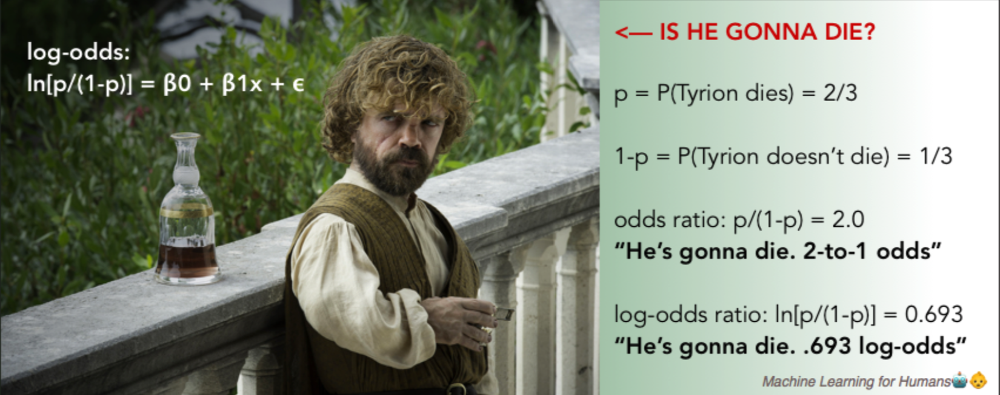
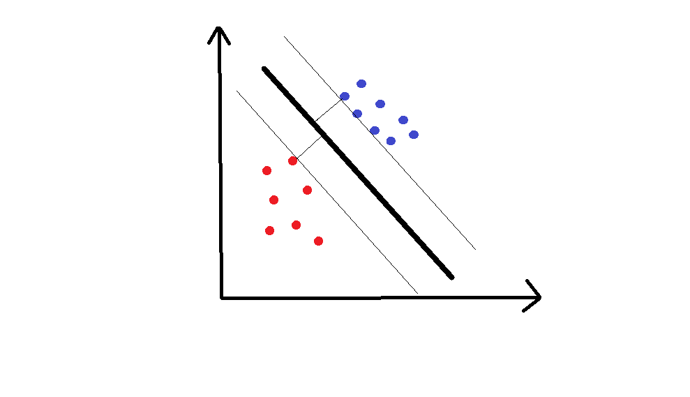
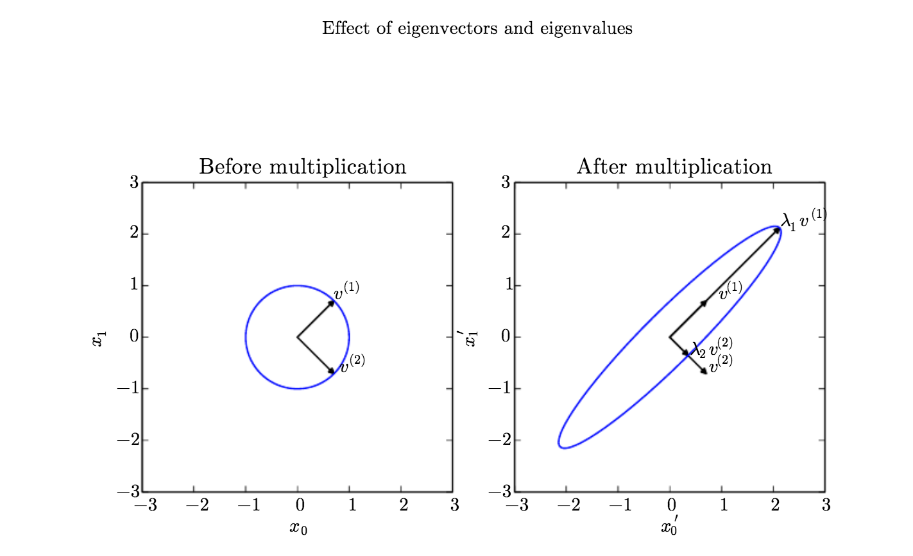

**目录**

[TOC]

## 简介

监督式学习，是对有 `label` 标记的 `training example` 进行学习的问题（这个过程是一个启发式( heuristics) 的过程）。一般情况下的，通用的公式：$Y=f(X)+\epsilon$，其公式的参数解释：

* $X$ (input) 
* $Y$ (output)
* $f$ (function) : 描述了 $X$ 和 $Y$ 之间的关系的函数
* $\epsilon$ (epsilon):  **平均值为 $0$ ** 的随机误差项
  *  **不可约误差( Irreducible Error )** $^{[1]}$ ，这是因为数据集中存在的噪声，在理论的极限范围内，它也会被模型算法给体现出来。这个就像用模型来模拟抛硬币的结果，它不可能得到绝对正确的结果
  *  还有一类误差是，因为创建的条件匹配的模型，并不能在实际复杂的数据集中得到良好的表现结果

监督式学习算法中，包括了线性回归（**Linear Regression**）和分类（**Classification**）。

### 线性回归

线性回归——最小二乘回归（**Ordinary Least Squares(OLS) Resgress**）

* 利用给定的 $X$ 得到新的 $y$ 以尽可能小的误差来学习线性模型

* 原理：线性回归是假定存在 $X$ 和 $y$ 的函数形式的参数法（**Parametric Method**），$\hat{y}=\beta_0+\beta_1*x+\epsilon$。目标是通过学习模型参数 $\beta_0$ 和 $\beta_1$ 来最小化模型预计的误差

* 步骤：

  1. 定义损失函数（**Cost Function** 或者 **Loss Function**）用于评估模型预计值的不准确度

     损失函数 $Cost=\frac{\displaystyle{\sum_i^n((\beta_1x_i+\beta_0)-y_i)^2}}{2*n}$，其中 $n$ 为数据规模，其中在分母中使用 $2*n$ 是为了方便在求导计算最小损失时，让表达式更清洁。然而随着损失函数的复杂度增加（例如 $\beta$ 参数数量增加，数据特征增加），难以通过微积分法来实现求解。因此引入了另一种迭代方法——梯度下降（**Gradient Descent**），它可以见下损失函数的复杂性。

     梯度下降的目标是找到模型的损失函数的最小值，其需要通过不断的迭代来得到越来越近似的值。即每一步都沿着“坡度”下降最大的一步来做，当达到越来越平坦时即是较优解。算法收敛（**Converged**）和损失值的最小化，表示最终取得了较优解

  2. 找到损失值最小的参数

### 分类

分类的结果是预测的离散型 `label` ，是为了解决观测值可能是属于哪一个类别（**class**）

#### 逻辑回归

* 逻辑回归（**Logistic Regression**）一种分类方法，模型输出的结果是分类属于哪一个类的概率。逻辑回归不仅可以进行分析二分类（**Binary Classification**），而且可以进行多类别分类——例如数字识别。常用的例子，信用欺诈分析。

  > 最小二乘法不适用于二分类问题，因为预测的结果是 $0$ 或者 $1$，预测得到的概率是小于 0 或者大于 1 的，这样导致概率没有意义。因此需要使用逻辑回归模型，这样得到的概率值就是在 $0\%$ 和 $100\%$ 之间以此来确认结果属于哪个类别

* 数学原理：

  这里使用的是 **Sigmoid** 函数， $S(x)=\frac{1}{1+e^{-x}}$。而在实际应用层面上，模型是一个复合函数，$。P(Y=1|x)=F(g(x))=\frac{1}{1+e^{-(\beta_0+\beta_1*x)}}$通过数学方式转换可以转换为一个“线性模型”， $\ln(\frac{p}{1-p})=\beta_0+\beta_1x+\epsilon$，这样就转换为了一个自然对数的 **Odds Ratio($\frac{p}{1-p}$)**。需要注意⚠️ $\beta_1$ 参数表示的是随着 $x$ 变化，**log-odds ratio** 的变化率——即是 **log-odds** 的斜率，而非概率的斜率

  

* 阈值（**Threshold**）

  阈值的设定，指示了分类问题的概率划分。**依据** 于具体任务对假正例（**False Positives**）和假负例（**False Negative**）忍耐，因为不同的时间对两者要求存在差异

* 损失函数

  $Cost(\beta)=\frac{\displaystyle{\sum_{i=1}^n}(y^i\log(h_{\beta}(x^i))+(1-y^i)\log(1-h_{\beta}(x^i))^2}{2*n}+\lambda\displaystyle{\sum_{j=1}^k}\beta_j^2$，该函数包括了第一部分数据损失，以及第二部分正则损失。需要注意这里的损失函数是最大似然数的方式来推导的，这个[逻辑回归损失函数解释 ](https://www.zhihu.com/question/47744216/answer/146117429)说明了它的推导方式。

#### 支持向量机(`SVM`)

`SVM` 是一个参数模型，主要解决的也是二分类问题，并且和逻辑回归有同样的优异表现；但是它是以几何的角度来建立的模型，而非概率角度建立模型。

* 原理：`SVM` 建立的是一个区分线（**Separating Line**）、高维空间中超平面（**Hyperplane**）来区分数据，需要建立的是最近的点到线或平面的距离（即 **Margin**）达到最大。 例如下面的二维数据

  

## 名词解释

* 特征( **Features** )：一般指数据属性。而数据可能是数值型数据（**Numerical**），也有可能是类别性数据（**Categorical**）

* 偏导（**Partial Derivative**）[偏导](https://en.wikipedia.org/wiki/Partial_derivative) 说明了参数$\beta$ 增减变化，导致总损失值的变化

* 过拟合（**Overfitting**）：学习的模型能够完美解释训练数据，但是不能对未遇见的数据泛化。这是因为模型过分的将训练数据特性，来解释现实情况

* 欠拟合（**Underfitting**）：和过拟合相反，模型的复杂性不足以捕捉到数据的趋势

* 正则化（**Regularization**）

* 超参数（**Hyperparameter**)：模型中的通用设置，用于控制调节参数的增加和下降以提高模型表现。例如正则项中的 $\lambda$

* 交叉验证（**Cross-validation**）在模型训练的过程中，从训练数据留出一部分作为验证模型的数据集，用训练模型来验证对留出的数据解释情况

* 逻辑回归函数：
  $$
  \begin{cases}
    P(y=1|x, \beta)=\frac{1}{1+e^{-\beta^Tx}} \\
    P(x=0|x,\beta)=\frac{1}{1+e^{\beta^Tx}} =1-P(y=1|x,\beta) \\
  \end{cases} \\
  假设：h_\beta(x)=g(\beta^Tx)=\frac{1}{1+e^{-\beta^Tx}}
  $$
  

  

## 问题解决方案

### 1. 过拟合的解决方式

一般情况下，可以通过两种方式来进行控制过拟合：

* 增大训练数据集   使用的训练数据集越大，越难以过拟合
* 使用正则化  对损失函数时使用惩罚（**penalty**），这样一方面增加了任何 `feature` 的解释效用，另一方面也可以允许更多的 `features` 被纳入训练

$Cost=\frac{\displaystyle{\sum_i^n((\beta_1x_i+\beta_0)-y_i)^2}}{\displaystyle{2*n}}+\lambda \displaystyle{\sum_{i=0}^1\beta_i^2}$ 公式中，第二部分即是正则项，它对大的参数项给予更多的解释效用（**Explanatory Power**）——它可以控制数据避免过拟合。

正则项中的参数，主要包括两块：

* $\lambda$：它是损失函数中正则项的超参数，其值越大对大的参数（参数越大，潜在越可能过拟合）惩罚越严厉

## 参考

1. [利用学习曲线诊断模型的偏差和方差 ](https://www.jiqizhixin.com/articles/2018-01-23)

2. [LinearAlgebra](http://www.deeplearningbook.org/contents/linear_algebra.html)

   解释了线性代数的常用知识:

   * **Scalers**: 仅指单一数字，可能是一个自然数或者实数
   * **Vectors**：数值数组 $\mathbb{R}^n$ ——表示了 $n$ 行数据；
   * **Matrices**：二维数值数组，一般用  $\it{A}\in{\mathbb{R}^{m\times{n}}}$ 表示 $m$ 行 $n$ 列数组，其元素表示 $\it{A}_{i,j}$
   * **Tensors**：超过二维的数组， 一般用 $\bold{A}$ ，其元素表示方法为 $\bold{A}_{i,j,k}$

   **Matrix** 运算：

   * 加法运算：$\it{C_{i,j}}=\it{A_{i,j}}+\it{B_{i,j}}$
   * 标量乘积和标量加：$\it{D_{i,j}}=a\dot{}\it{B_{i,j}} +c$
   * 向量加：$\it{C_{i,j}}=\it{A_{i,j}}+b_{j}$，向量会隐形转换为 $i$ 行进行运算
   * 乘积运算（即 **dot product**）：$\it{C_{i,j}}=\displaystyle \sum_{k} \it{A_{i,k}}\it{B_{k,j}}$，这个和每个元素级别的相乘不同（注意：向量的乘法也遵从同维度性要求 $\it{x}^T\it{y}$），元素的相乘（即 **Hadamard product**）的表示方法是 $\it{A}\bigodot\it{B}$
   * 分配律（**distributive**）$\it{A}(\it{B}+\it{C})=\it{AB}+\it{AC}$
   * 结合律（**associative**）$\it{A}(\it{B}\it{C})=(\it{A}\it{B})\it{C}$，需要注意维度要求，另外矩阵的交换律不一定相等，然而向量交换律一定相等

   单位矩阵（**Identity Matrix**）：

   - 定义：当乘以任何向量时，不会改变向量的矩阵。$\forall \it{x} \in \mathbb{R^n}, \mit{I_n}\it{x}=\it{x}$
   - 特点：沿着对角线上值为 $1$，而其他值为 $0$

   矩阵逆（**Inverse Matrix**）：

   - 定义：$\it{A}$ 的逆表示 $\it{A}^{-1}$。$\it{A^{-1}A}=\it{I_n}$
   - 作用：可逆矩阵可以用于求解值 $\it{I_nx}=\it{A^{-1}b}$，它是由该公式推导出来的 $\it{A^{-1}Ax}=\it{A^{-1}b}$

   线性组合（**Linear Combination**），生成空间（**Span**），线性相关（**Linear Dependence**）：

   * 线性组合的表达式 $\it{Ax}=\displaystyle{\sum_i\it{x_i}A:,i}$，可以以向量集合 ($\{v^{(1)}, ...,v^{(n)}\}$) 的方式来表达—— $\it{Ax}=\displaystyle{\sum_ic_i v^{i}}$
   * 生成空间，指原始向量的线性组合可以所有的点集。这样的向量集合即是构成了生成空间

   奇异矩阵（**Singular Matrix**）和 方阵（**Square Matirx**）：

   - 当 $\mathbb{R^{m\times{n}}}$ 中 $m=n$ 时，且所有的列是线性不相关（**Linear Independent**），那么这样的矩阵即为方阵（或者说为非奇异矩阵）
   - 当 $\mathbb{R^{m\times{n}}}$ 中 $m=n$ 时，但有的列是线性相关（**Linear Dependent**），那么这样的矩阵即为奇异矩阵

   范数（**Norms**）：包括了 $L^p​$ 范数

   * 计算方式 $ \shortparallel \bold x \shortparallel_p=(\displaystyle\sum_i\mid x_i\mid ^p)^{\frac{1}{p}}$，其中 $p\in\mathbb{R}, p\ge1$
   * 特性：1）$f(x)=0\to x=0$；2）$f(x+y)\leq f(x) + f(y)$，即三角不等式性质；3）$\forall \alpha \in \mathbb{R}, f(\alpha x)=|\alpha|f(x)$
   * 当 $p=2$ 时，即计算的是欧式范数（**Euclidean Norm**）。它在机器学习中的实际应用，因为它针对邻近 **Origin** 的元素增长缓慢，  难以区分各元素是真为 $0$ 还是值很小但并不为 $0$。
   * 当 $p=1$，即 $\it{L^1}$ 范数，$\shortparallel{x}\shortparallel_{1}=\displaystyle{\sum_i|x_i|}$。它的实际应用是解决了欧式范数难以区分 $0$ 和值很小的情况
   * 当 $p=\infin$， 计算的是 $L^{\infin}$ 表示的是 **Max Norm**，$\shortparallel{x}\shortparallel_{\infin}=\displaystyle{\max_i}|x_i|$
   * 在深度学习中，常用的范数是弗罗贝尼乌斯范数（**Frobenius norm**）或希尔伯特-施密特范数（**Hilbert–Schmidt norm**），它是模拟了向量的欧式范数计算方式，$\parallel{A}\parallel_F=\sqrt{\displaystyle{\sum_{i,j}A_{i,j}^2}}$，

   特殊类型的矩阵和向量：

   * 对角矩阵（**Diagonal Matrix**）：在主对角线上具有非零值，而非对角线上具有零值。数学表表达式——$\forall i\ne j, \it{D_{i,j}}=0 \iff \it{D}\ is\ diagonal\ matrix$。对角线矩阵的向量表示，$diag(v)$ 表示向量 $v$ 的每个元素可以表达对角方阵中的值，因此下面的这个表达式结果是相同的 $diag(v)x=v \bigodot x$

   * 对称矩阵（**Symmetric Matrix**）：转置矩阵和原矩阵相同的一类矩阵，其表达式是：$\it{A}=\it{A^{T}}$。在实际表现为，两个参数的函数不依赖参数的顺序，例如矩阵的距离测量——给定的 $i$ 到 $j$ 的距离计算与顺序无关， $\it{A_{i,j}}=\it{A_{j,i}}$，因为距离函数是对称的

   * 单位向量（**Unit Vector**）：模为单位值的向量，$\parallel x \parallel_2 = 1$

   * 向量正交（**Orthogonal**）如果向量之间存在 $\it{x^Ty}={0}$ 的关系，那么两个向量互相存在正交关系。如果两个向量模长为非零，即说明两个向量的 **夹角** 为 $90^o$。如果向量不仅是正交而且是具有单位模长（ unit norm），那么这样的向量具有标准正交性（**Orthonormality**）

   * 正交矩阵（**Orthogonal Matrix**）方阵的行与行之间和列与列之间是相互正交， $\it{A^TA}=\it{AA^T}=\it{I}$，而这也说明了 $A^{-1}=A^T$——因此，正交矩阵的逆计算很方便

   * 特征分解（**Eigendecomposition**）

     在数学对象中，通过将对象分解为组成“部件”，或者找到具有普遍代表特性，并且不是因为人为选择的原因所具有的某些特性。例如整数可以被分解为质数，这样不因为书写进制差异，都能表示出整数的特性（例如整除）$12=2 \times 2 \times 3$ 式子表示了 12 可以被 3 整除 而不能被 5 整除

     同样的在矩阵中，使用同样的方式从矩阵中找到数据方式表达。这种方式即是特征分解，矩阵被分解为特征向量（**Eigenvectors**）和特征值（**Eigenvalues**），其表达式是 $\it{Av}=\it{\lambda v}$， 非零向量 $v$ 乘以 $\it{A}$ 等于标量 $\lambda$ （即是特征值）与向量 $v$ （即特征向量，可以用右特征向量称，这是因为存在左特征向量 $v^TA=\lambda v^T$ 。常用右特征向量来表示特征向量）相乘

     假设矩阵 $A$ 具有 $n$ 个线性不相关的特征向量 ${v^{(1)}, ..., v^{(n)}}$ 以及对应的特征值 $\lambda_1, ..., \lambda_n$，通过将特征转换为矩阵形式 $V={v^{(1)}, ..., v^{(n)}}$ 以及 $\rm{\lambda}=\lambda_1, ..., \lambda_n$ ，此时的矩阵的特征分解为：

     $$A=\it{V}diag(\lambda)\it{V^{-1}}$$

     

     * 正定矩阵（**Positive Definite**）特征值都是正数的矩阵，它保证了 $x^TAx=0 \Rightarrow x=0$
     * 半正定矩阵（**Positive Semidefinite**）特征值是正数或者零值的矩阵，它保证了 $\forall x, x^TAx \ge 0$
     * 负定矩阵（**Negative Definite**）特征值全是负数的矩阵
     * 半负定矩阵（**Negative Semi definite**） 特征值是负数或者零值的矩阵

   * 奇异值分解（**Singular Value Decomposition**）：

     奇异值分解提供了另一种方法将矩阵分为奇异向量（**Singular Vectors**）和奇异值（**Singular Values**）。它提供了可以特征分解解析得到的相同信息，但是它更具有实用性。每一个矩阵均可以进行奇异值分解，但是却不一定有特征值分解——例如非方阵矩阵。其中奇异值对应的表达式为 $A=UDV^{-1}$，假设矩阵 $A \in \mathbb R^{m\times n}$，$U \in \mathbb R^{m \times m}$， $D\in \mathbb R^{m\times n}$，$V\in \mathbb R^{n \times n}$，其中 $V$ 和 $U$ 均是正交矩阵， $D$ 是一个对角矩阵（可以不一定为方阵）。其中 $D$ 的对角上的元素值为矩阵 $A$ 的奇异值，$U$ 是一个左奇异向量（可以通过特征值分解来做解释，即特征向量 $AA^T$），$V$ 为右奇异向量（可以通过特征值分解来做解释， 即特征向量 $A^TA$)。

   * 摩尔-彭若斯广义逆（**Moore-Penrose Pseudoinverse**）

     对非方阵的逆矩阵此前尚未定义，因为之前的定义中是通过得到矩阵的左逆来得到结果 $Ax=y , \Rightarrow x=By$——它是依赖矩阵 $A$ 的唯一映射产生 $B$ 来得到结果，当 $m\neq n$ 时是难以通过该方式来得到结果。

     广义逆克服了改问题，表达式为 $A^+=\displaystyle{\lim_{\alpha\searrow 0}}(A^TA+\alpha I)^{-1}A^T$。在实际应用层面上，并非使用该表达式而是使用了 $A^+ = VD^+U^T$。

     * 针对列数大于行数的问题，通过广义逆提供的其中可能解来解决线性等式。特别是提供的可能解 $x=A^+y$ 的最小欧式模长 $\parallel x \parallel_2$ 的值是最可能解
     * 针对行数大于列数的问题，一般情况下是没法求解。但是可以使用广义逆的方式 $Ax$ 趋近于 $y$ 的欧式距离（$\parallel Ax-y \parallel_2$）来检验求得 $x$

   * 迹运算（**Trace Operator**）：计算的是矩阵对角线上元素的和 $Tr(A) = \displaystyle{\sum_i A_{i,i}}$。

3. [An Introduction to Gradient Descent and Linear Regression](https://spin.atomicobject.com/2014/06/24/gradient-descent-linear-regression/)

   从示例演示以及数学解释的角度，来说明了线性回归中的梯度下降。其中演示的代码地址[GradientDescentExample](https://github.com/mattnedrich/GradientDescentExample)

4. [Understanding gradient descent - Eli Bendersky's website](https://eli.thegreenplace.net/2016/understanding-gradient-descent/)

   从数学的角度，严谨地解释了梯度下降
