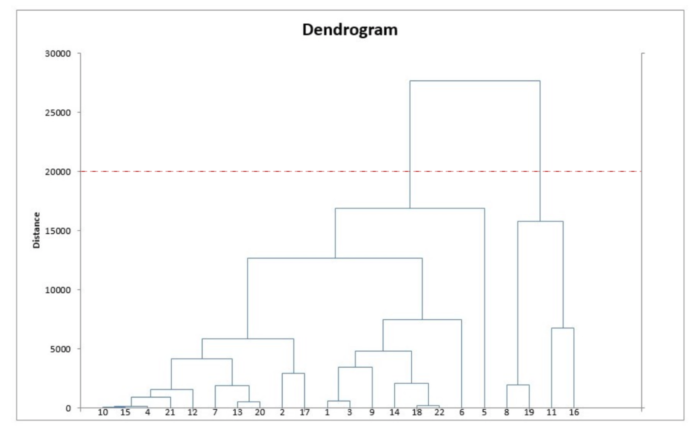
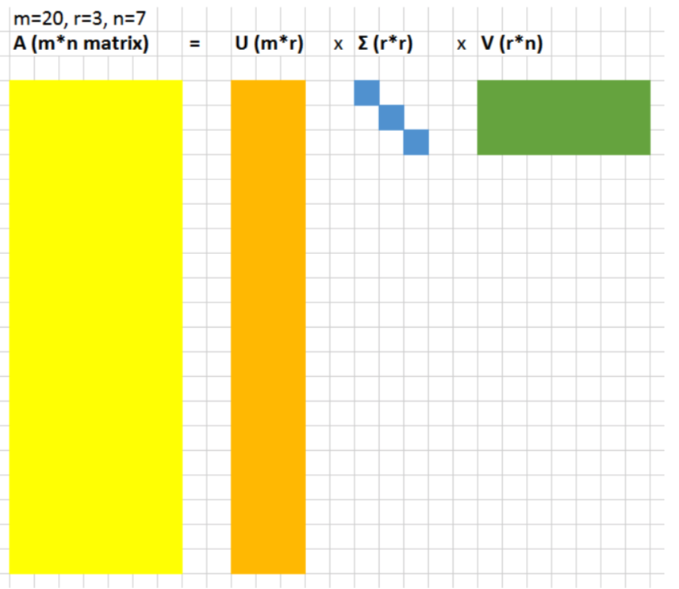
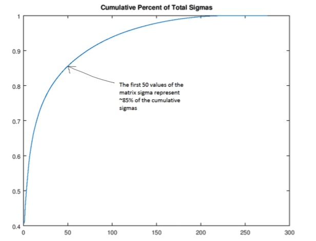
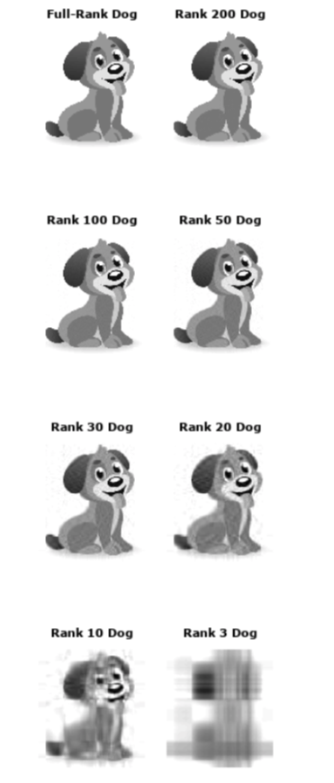

**目录**

[TOC]

## 简介

非监督式学习（**Unsupervised Learning**）：使用没有标记的数据（**Unlabeled Data**）进行学习的过程。其中需要注意相比于监督式学习，非监督式学习的结果不容易选择合适的指标来评估算法模型的表现，这通常是一个直观且具有领域知识相关（**Domain Specific**）。在非监督式学习中主要有两个任务：1）探索数据的群组类别，需要依据相似度将数据聚合到群组中；2）在保证数据结构和信息有用性的情况下，对数据进行降维来压缩数据。因为具有独特的作用，常被用于进行数据预处理。

使用非监督式学习可以解决的实际例子：

* 在广告平台中，利用相似度人口画像（**Demographics**）和购买习惯将消费者进行分成不同的群组以便进行定向定投广告
* `Airbnb` 将房屋按照社区进行群组，以便用户能够更容易导航
* 降低数据维度，以便增强模型和降低文件数据大小

## 聚类——`Clustering`

聚类在实际生活中的例子就是市场划分，以及广告定向投放。接下来将首先以几个主要的方法来阐述聚类的实施方式及其表现。

### `K-means clustering`

目的是需要将数据点分配到 `k` 个群组中，其中 `k` 越大，群组会被划分得更小而具有更大的粒度，反之则群组更大，数据粒度更小。得到的结果是被分配到 `k` 个群组中的数据而具有了 `label`——并非真正的具有数据标签，这些 `label` 是根据群组中心点（**Centroid**）创建的。

`Centroid` 是聚类的中心，它能够捕获数据中最接近的点，且将它们进行聚类。该算法模型构建的步骤如下：

* 随机定义 `k` 个中心点，这需要使用高级算法来随机初始化中心点，这样才能快速的收敛
* 找到最近的中心点，并且更新群组值。这里需要将每个数据点分配到 `k` 个群组中，通过计算出数据点最邻近的群组，需要注意这里最邻近地计算的超函数通常使用的是欧式距离——重复计算点
* 移动原中心点到群组的中心，新的中心点的位置是通过计算所有点的平均值来得到的——更新中心位置
* 重复以上两个步骤，直到最终收敛

但是需要注意的是这种算法得到的结果可能不是唯一的，因为它依赖于初始化中心点的位置。孤心点出现，也就是体现出了初始化的位置和 `k` 值的影响——当出现其他数据点到孤心点时，数据被其他中心点给分配了。

因此在该算法中一方面重要的因素选择合适的 `k` 值，另一方面是采用合适的初始化策略。接下来将针对初始化策略进行分析：

* 直接的方式	随机的从所有数据点中选择中心点。这种方式的并不是最佳的，因为它可能出现中心点被初始化到相同的 `cluster` 中。当然如果恰巧的选择了正确 `k` 值，而且 `k` 个群组都有相同的数据点，那么这种概率是 $\frac{k!}{k^k}$。通过使用斯特灵公式（**Stirling’s Approximation**）模拟计算，大约是 $\frac{\sqrt{2\pi k}}{e^k}$ ，这个时候运行效率还是比较高的
  * 相对来说的比较好的方式是，是使用“最远”启发式方法。先随机初始化第一个中心点，第二个中心点是远离第一个中心点的数据中的点。总体的方法就是，第 $j$ 个中心点都是远离之前初始化中心点的数据点。更新数据方面使用的是 `packed circles` 数据的方式。这样的结果就是让所有的中心点都是互相远离的，并且每个中心点都可能被区分到所有的群组中
* 当然还有可用的较佳方式，叫 `k-means++` 。它和最远启发法比较相似，除了选择后续的初始化中心点方面。计算每个样本与当前已有类聚中心最短距离（即与最近一个聚类中心的距离）；这个值越大，表示被选取作为聚类中心的概率较大；最后，用轮盘法选出下一个聚类中心——以此选择出不同的中心点。

重要的最用是在能够粗略而快速的得到类别，特备是对高斯混合数据，能够选择合适的数量的中心点和启发式算法进行 [Packed Circle](https://en.wikipedia.org/wiki/Circle_packing) 分类数据。当然还有其他方法可以用于进行优化—— [k-medians](http://en.wikipedia.org/wiki/K-medians_clustering), [k-medoids](http://en.wikipedia.org/wiki/K-medoids), [k-means++](http://en.wikipedia.org/wiki/K-means%2B%2B), 和  [EM algorithm for Gaussian mixtures](http://en.wikipedia.org/wiki/Expectation-maximization_algorithm#Gaussian_mixture) 

### 层次聚类分析——`Hierarchical clustering `

该算法和一般的聚类算法相似，差异是在于该算法目的在于建立聚类的层次。在解决聚类的数量是弹性的问题方面，是非常有用的。例如解决在线超市的商品项分类问题上，需要解决的问题是将商品分类从上到下进行详细分类。

在最后确立的模型中同样可以建立一个层次结构树形。算法的步骤如下：

1. 以 N 个聚类开始，每个聚类都能将所有数据分割
2. 将相互之间最相近的聚类进行结合，这样的话就会建立一个 N-1  个聚类
3. 再次计算聚类之间的距离——这里的计算方式有多种方法，例如平均连结聚合算法（**Average-Linage Clustering**）就是以两个聚类之间的所有成员距离的平均值
4. 继续重复第二和第三步，直到最终一个聚类能够将所有数据点囊括，这样就得到的最终的树形
5. 选择聚类的数量，并以此来绘制一个纵向树形图（**Dendrogram**）

## 降维——`Dimensionality Reduction`

降维的方式，非常像压缩的方式。降维的主要目的还是在保持相关数据结构的情况下，减少数据的复杂度。主要的降维方式有 **主成分分析（Principle Component Analysis）** 以及 **奇异值分解（Singular Value Decomposition）**。

### 主成分分析

主成分分析，需要参考线性代数中的空间（**Spaces**）和基（**Bases**）。通过选择子集来构成新的空间，这个空间的维度比原始维度要小，但是尽最大可能性保留了数据的“复杂度”——这个的度量主要是通过能捕捉到的方差来做比较。

### 奇异值分解

奇异值分解特点，即是将矩阵信息分解为三个主要矩阵——其中矩阵 $\sum$ 即是奇异值，通过另外两个举证 $\rm U$ 和 $\rm V$  来代表原数据。

其中比较明显的作用，如下图当前 50 个奇异值即可包括 85% 的数据信息

下图是实际演示说明：

## 参考

1. [K-means++ - Wikipedia](https://en.wikipedia.org/wiki/K-means%2B%2B) 

2. [K-means聚类算法的三种改进(K-means++,ISODATA,Kernel K-means)介绍与对比](https://www.cnblogs.com/yixuan-xu/p/6272208.html)  

3. [Visualizing K-Means Clustering](https://www.naftaliharris.com/blog/visualizing-k-means-clustering/) 

4. [Handwritten Digit Recognition Using K-Nearest Neighbour Classifier - IEEE Conference Publication](https://ieeexplore.ieee.org/document/6755106/?reload=true) 

   这个是手写数字识别的示例，可以查询相关文档

5. [Clustering (2): Hierarchical Agglomerative Clustering - YouTube](https://www.youtube.com/watch?v=OcoE7JlbXvY) 

   讲解层次聚类分析

6. [3-2 Hierarchical Clustering (阶层式分群法)](http://mirlab.org/jang/books/dcpr/dcHierClustering.asp?title=3-2%20Hierarchical%20Clustering%20(%B6%A5%BCh%A6%A1%A4%C0%B8s%AAk)&language=chinese)

7. [Diffusion Mapping and PCA on the WikiLeaks Cable Database](http://mou3amalet.com/cargocollective/675_xuesabri-final.pdf)

   PCA 相关论文

8. [Cool Linear Algebra: Singular Value Decomposition - Andrew Gibiansky](http://andrew.gibiansky.com/blog/mathematics/cool-linear-algebra-singular-value-decomposition/)

   奇异值分解的阐释